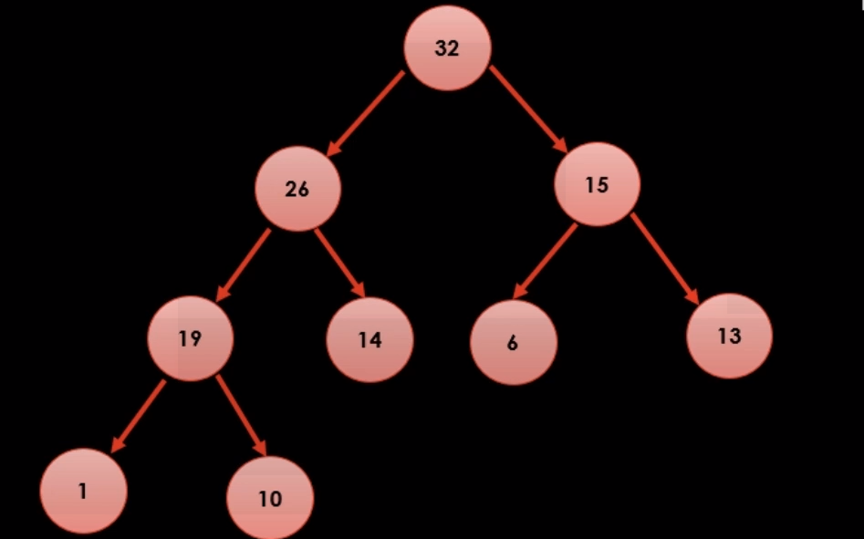
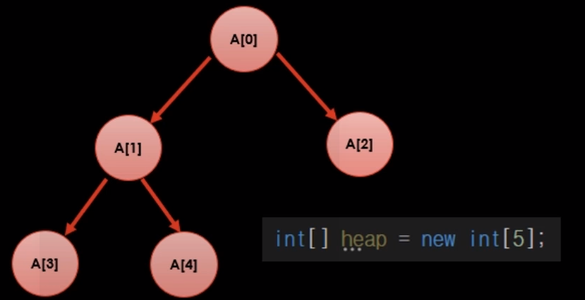

## 트리 이론

### 트리의 개념

- 계층적인 구조를 갖는 데이터 표현
- 노드 : 데이터를 표현
- 간선 : 노드의 계층구조 표현

### 트리 관련 용어

- 부모 노드
- 자식 노드
- 형제(sibling) 노드 : 같은 부모를 가지고 있는 동일한 레이어의 노드들
- 선조(ansestor) : 내 부모의 부모 노드
- 자손(descendant)
- 루트
- 잎 : 자식이 없는 노드
- 노드 깊이 : 최상위 조상을 기준으로 depth를 몇개 내려가는지 , 루트부터 0으로 센다.
- 트리 높이 : 잎 노드를 기준으로 몇개 올라가는지, 잎부터 0으로 센다.
- 트리의 재귀적 속성 및 서브 트리

### 힙 이론

### 이진 트리 개념

- 각 노드가 최대 두개의 자식 노드를 갖는 트리

### 이진 검색 트리 특징

1. 왼쪽을 타고 가면 현재 값보다 작다
2. 오른쪽을 타고 가면 현재 값보다 크다.

### 이진 검색 트리 문제

- 그냥 무식하게 추가하면 한쪽으로 기울어져서 균형이 깨진다.
- 트리 재배치를 통해 균형을 유지하는것이 과제(AVL, Red-Black)

### 힙 트리 특징

 

- 힙트리 1 법칙 : 부모 노드가 가진 값은 항상 자식 노드가 가진 값보다 크다.
- 힙트리 2 법칙 : 노드 개수를 알면, 트리 구조는 무조건 확정할 수 있다.
    - 마지막 레벨을 제외한 모든 레벨에 노드가 꽉 차 있다.
    - 마지막 레벨에 노드가 있을 때는 항상 왼쪽부터 순서대로 채워야한다.
    - **따라서 배열을 이용해서 힙구조를 바로 표현할 수 있다.**

         
        
        - `i` 번 노드의 왼쪽 자식은 `[(2 * i) + 1]` 번
        - `i` 번 노드의 오른쪽 자식은 `[(2 * i) + 2]` 번
        - `i` 번 노드의 부모는 `[(i - 1) / 2]` 번

### 힙트리 새로운 값 추가

1. 노드 개수를 알면, 트리 구조는 무조건 확정할 수 있다. 우선 트리 구조부터 맞춰준다.
    - 맨 하단 왼쪽 노드부터 채운다.
2. 부모 노드가 가진 값은 항상 자식 노드가 가진 값보다 커야한다. 새로 추가한 말단 노드 에서 부터 위로 정렬해준다.
    - 위로 계속 비교해서 올려준다.

### 힙트리 최댓값 꺼내기

1. 힙트리 특성상 루트 노드가 최댓값, 바로 빼낸다.
2. 노드의 개수를 알면 트리 구조는 무조건 확정할 수 있다.
    - 제일 마지막에 위치한 데이터를 루트로 옮긴다.
3. 부모 노드가 가진 값은 항상 자식 노드가 가진 값보다 커야한다. 새로생긴 루트 노드에서 부터 역으로 아래로 정렬해준다.