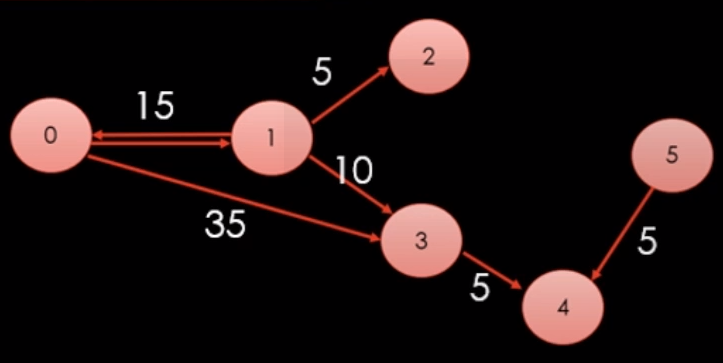

## 그래프 이론

### 그래프 개념

- 정점(vertex) : 데이터를 표현 ( 사물 , 개념 등)
- 간선(Edge) : 정점들을 연결하는데 사용

- 간단하게는 아래와 같이 코드 구현할 수 있다. 이는 매번마다 `new Vertex()`를 해서 정점을 생성한 뒤에 엣지로 엮인 정점들을 추가해줘야한다.

    ```csharp
    class Vertex
    {
        public List<Vertex> edges = new List<Vertex>();
    }

    void CreateGraph()
    {
        List<Vertex> v = new List<Vertex>(6)
        {
            new Vertex(),
            new Vertex(),
            new Vertex(),
            new Vertex(),
            new Vertex(),
            new Vertex(),

        };
        // (0) ---> (1)
        v[0].edges.Add(v[1]);
        v[0].edges.Add(v[3]);
        v[1].edges.Add(v[0]);
        v[1].edges.Add(v[3]);
        v[1].edges.Add(v[1]);
        v[3].edges.Add(v[4]);
        v[5].edges.Add(v[4]);

    }
    ```

- 그냥 리스트만을 이용해서 코드를 구현해보자.

    ```csharp
    // 읽는 방법: adjacent[from] -> 연결된 목록
    // 리스트를 이용한 그래프 표현
    // 메모리는 아낄 수 있지만, 접근 속도에서 손해를 본다.
    // 간선이 적고 정점이 많은 경우 이점이 있다.


    List<int>[] adjacent = new List<int>[6]
    {
        //(0) ---> (1)
        //(0) ---> (3)
        new List<int> {1,3},
        //(1) ---> (0)
        //(1) ---> (2)
        //(1) ---> (3)
        new List<int> {0,2,3},
        new List<int> { },
        new List<int> { 4 },
        new List<int> {  },
        new List<int> { 4 },
    }
    ```

- 이제는 간선 위에 가중치를 부여해보자.

     


```csharp
class Edge
{
    public Edge(int v, int w) { vertex = v; weight = w; }
    public int vertex;
    public int weight;
}

List<Edge>[] adjacent = new List[Edge][6]
{
    new List<Edge>() {new Edge(1,15), new Edge(3,35)},
    new List<Edge>() {new Edge(0,15), new Edge(2,5), new Edge(3,10)},
    new List<Edge>() {},
    new List<Edge>() {new Edge(4,5)},
    new List<Edge>() { },
    new List<Edge>() {new Edge(4,5)},
};
```

- 접근 속도를 높이기 위해 행렬을 사용해 구현할 수 있다.

    ```csharp
    // 읽는 방법: adjacent2[from, to]
    // 메모리 소모가 심하지만, 빠른 접근이 가능하다.
    // 정점은 적고 간선이 많은 경우 이점이 있다.
    // 만약에 정점 1이 3 과 연결되어있는지 확인하려면 adjacent2[1][3]이 0인지 1인지만 판단
    int [,] adjacent2 = new int[6,6]
    {
        {0,1,0,1,0,0},
        {1,0,1,1,0,0},
        {0,0,0,0,0,0},
        {0,0,0,0,1,0},
        {0,0,0,0,0,0},
        {0,0,0,0,1,0},

    }
    ```

- 행렬 구조에 간선에 가중치 부여

    ```csharp
    int [,] adjacent2 = new int[6,6]
    {
        {-1,15,-1,35,-1,-1},
        {15,-1,5,10,-1,-1},
        {-1,-1,-1,-1,-1,-1},
        {-1,-1,-1,-1,5,-1},
        {-1,-1,-1,-1,-1,-1},
        {-1,-1,-1,-1,5,-1},
    }
    ```


- 구현한 구조를 통해 DFS를 구현 할 수 있다.

    ```csharp
    using System;
    using System.Collections.Generic;


    namespace Exercise
    {

        class Graph
        {
            int[,] adj = new int[6, 6]
            {
                { 0, 1, 0, 1, 0, 0 },
                { 1, 0, 1, 1, 0, 0 },
                { 0, 1, 0, 0, 0, 0 },
                { 1, 1, 0, 0, 1, 0 },
                { 0, 0, 0, 1, 0, 1 },
                { 0, 0, 0, 0, 1, 0 },
            };

            List<int>[] adj2 = new List<int>[]
            {
                new List<int>() { 1, 3 },
                new List<int>() { 0,2,3},
                new List<int>() { 1},
                new List<int>() { 0, 1, 4},
                new List<int>() { 3, 5},
                new List<int>() { 4 },
            };

            bool[] visited = new bool[6];
            // 1) 우선 now부터 방문하고
            // 2) now와 연결된 정점들을 하나씩 확인해서, [아직 미방문 상태라면] 방문한다.
            public void DFS(int now)
            {
                Console.WriteLine(now);
                visited[now] = true;

                for (int next = 0; next <6; next++)
                {
                    if (adj[now, next] == 0) // 연결되어있지 않으면 skip
                        continue;
                    if (visited[next]) // 이미 방문 했으면 skip
                        continue;
                    DFS(next);
                }
            }
            public void DFS2(int now)
            {
                Console.WriteLine(now);
                visited[now] = true;

                foreach(int next in adj2[now])
                {
                    if (visited[next]) // 이미 방문 했으면 skip
                        continue;
                    DFS2(next);
                }
            }

        }
        class Program
        {
            static void Main(string[] args)
            {
                // 그래프 순회 방법
                // DFS (Depth First Search 깊이 우선 탐색)
                // BFS (Breath First Search 너비 우선 탐색)

                Graph graph = new Graph();
                // graph.DFS(0);
                graph.DFS2(0);

            }
        }
    }

    ```

- 위의 코드는 끊어진 그래프 두개를 탐색할 수 없다. 모든 정점을 순회하는 함수를 만들어보자.

    ```csharp
    public void SearchAll()
    {
        visited = new bool[6];
        for (int now = 0; now < 6; now++)
            if (visited[now] == false)
                DFS(now);
    }
    ```